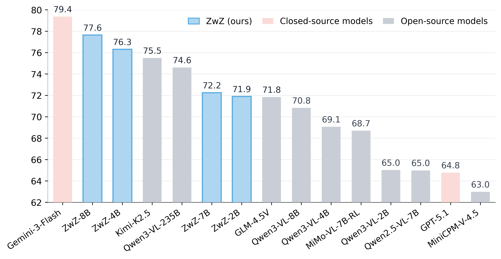
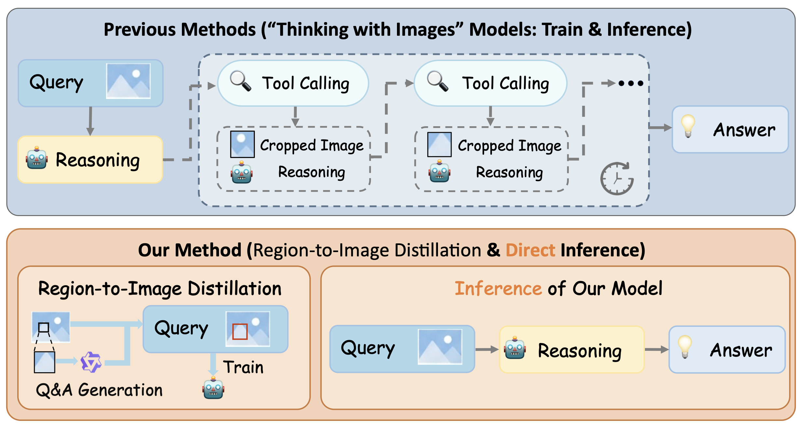

# Zooming without Zooming: Region-to-Image Distillation for Fine-Grained Multimodal Perception

<div align="center">
  Lai Wei<sup>1,2,3</sup>,
  Liangbo He<sup>2</sup>,
  Jun Lan<sup>2</sup>,
  Lingzhong Dong<sup>1,2</sup>,
  Yutong Cai<sup>1</sup>,
  Siyuan Li<sup>2</sup>,
  Huijia Zhu<sup>2</sup>,
  Weiqiang Wang<sup>2</sup>,
  Linghe Kong<sup>1</sup>,
  Yue Wang<sup>3</sup>,
  Zhuosheng Zhang<sup>1</sup>,
  Weiran Huang<sup>1,4</sup>
</div>

<p align="center">
<i>
1. School of Computer Science, Shanghai Jiao Tong University &nbsp;<br> 
2. Ant Group &nbsp;<br>
3. Zhongguancun Academy &nbsp;<br>
4. Shanghai Innovation Institute &nbsp;
</i>
</p>

<p align="center">
📃 <a href="https://arxiv.org/pdf/2602.11858" target="_blank">Paper</a> | 
🤗 <a href="https://huggingface.co/collections/inclusionAI/zooming-without-zooming">Models & Training Datasets & ZoomBench</a> 
</p>


## ✨ Introduction

<div align=center>

</div>

Recent "Thinking-with-Images" methods improve fine-grained perception by iteratively zooming into regions of interest during inference, but incur high latency due to repeated tool calls and visual re-encoding. In this work, we present **ZwZ** models (4/7/8B), achieving **SOTA performance on multimodal perception benchmarks among open-source models**. In addition, we present **ZoomBench**, a hybrid-annotated benchmark of 845 VQA data spanning six fine-grained perceptual dimensions, together with a dual-view protocol that quantifies the global--regional "zooming gap".

## ⚙️ Method

<div align=center>

</div>


We propose **Region-to-Image Distillation (R2I)**, which transforms zooming from an inference-time tool into a training-time primitive. We:
1. **Zoom in** to micro-cropped regions and let strong teacher models generate high-quality VQA data
2. **Distill** this region-grounded supervision back to the full image with explicit bounding-box overlays
3. Enable smaller student models to achieve **single-glance fine-grained perception** without tool use

This can also be summarized as an idea of "Zooming without Zooming". The first "Zooming" refers to the training-time primitive: we zoom into micro-regions to synthesize fine-grained training data. In contrast, the second "Zooming" denotes the inference-time tool-use we seek to bypass.


## 🌟 Key Features

- **🎯 Superior Accuracy**: Achieve SOTA performance on perception benchmarks among open-source models
- **⚡ Single-Pass Efficiency**: Just need one forward pass, eliminating inference-time tool calling overhead
- **📈 Broad Improvements**: Enhance not only perception benchmarks but also out-of-distribution generalization on visual reasoning, GUI agent, and AIGC detection

- **🔍 ZoomBench**: A comprehensive benchmark with 845 samples across 6 fine-grained dimensions, featuring various evaluation protocols


## 🎯 Models and Datasets

### Models

| Model | Base |  Download |
|-------|------|----------|
| ZwZ-4B | Qwen3-VL-4B  | 🤗 [inclusionAI/ZwZ-4B](https://huggingface.co/inclusionAI/ZwZ-4B) |
| ZwZ-7B | Qwen2.5-VL-7B  | 🤗 [inclusionAI/ZwZ-7B](https://huggingface.co/inclusionAI/ZwZ-7B) |
| ZwZ-8B | Qwen3-VL-8B  | 🤗 [inclusionAI/ZwZ-8B](https://huggingface.co/inclusionAI/ZwZ-8B) |

---

### Training Datasets

Our Region-to-Image distilled training data (74K samples): 🤗 [inclusionAI/ZwZ-RL-VQA](https://huggingface.co/datasets/inclusionAI/ZwZ-RL-VQA)

Source image pools:
- SA-1B, LAION, MetaCLIP, Visual Genome, CC12M, STPLS3D (we just take a small part of images from each image pool)

Question Generator: Qwen3-VL-235B-A22B-Instruct

Answer Generators: Qwen3-VL-235B-A22B-Instruct, GLM-4.5V

---

## 📊 ZoomBench

We introduce 🤗 [**ZoomBench**](https://huggingface.co/datasets/inclusionAI/ZoomBench), a challenging benchmark for fine-grained multimodal perception:

- **845 high-quality samples** across 6 perceptual dimensions:
  - Fine-Grained Counting
  - OCR (text & symbol recognition)
  - Color Attributes
  - Structural Attributes
  - Material Attributes
  - Object Identification

- **Dual-View Protocol**: Each sample includes both full image and cropped region to quantify the "zooming gap"
- **Attention Map Analysis**: Evaluate whether the model grounds its predictions on task-relevant image regions from a view of interpretability
- **Hybrid Construction**: Gemini-2.5-Pro-generated + human-verified for quality and scalability
- **High Difficulty**: Average accuracy of Qwen2.5-VL-7B is only 42.5%


## 🛠️ Installation

```bash
git clone https://github.com/inclusionAI/Zooming-without-Zooming.git
cd Zooming-without-Zooming
pip install -r requirements.txt
git clone https://github.com/facebookresearch/sam3.git
cd sam3
pip install -e . # please refer to the official repo of SAM3 for detailed installation
cd ../EasyR1
pip install -e . # please refer to the official repo of EasyR1 for detailed installation
```

## 🔥 Let's Start

### 1. Data Synthesis

The pipeline supports checkpointing. Each step can be executed independently and resumed from any stage. Note that we use Qwen3-VL-235B and Sam3 to get a meaningful cropped image, and use Kimi-K2 to extract the majority answer.

```bash
cd Zooming-without-Zooming/data_synthesis

export MLLM_KEY="your_mllm_key"
export MLLM_URL="your_mllm_url"
export KIMI_KEY="your_llm_key"
export KIMI_URL="your_llm_url"

## step 1
python create_crops.py \
  --api_key "$MLLM_KEY" \
  --api_url "$MLLM_URL" \
  --image_folders "/path/images/sa1b" \  # Support multiple folders; replace to your own path (just containing images)
  --output_jsonl "generated_bboxes_sa1b.jsonl"

## step 2
python create_questions.py \
  --api_key "$MLLM_KEY" \
  --api_url "$MLLM_URL" \
  --input_files "generated_bboxes_sa1b.jsonl" \
  --output_file "generated_questions.jsonl" \
  --crop_output_dir "/path/images/crops" # Replace to your own path

## step 3
bash qwen_serve.sh

python create_answers.py \
  --api_key "$MLLM_KEY" \
  --api_url "$MLLM_URL" \
  --kimi_api_key "$KIMI_KEY" \
  --kimi_api_url "$KIMI_URL" \
  --input_file "generated_questions.jsonl" \
  --output_file "validated_vqa.jsonl" \
  --bbox_output_dir "/path/images/bbox_images" # Replace to your own path

## step 4
python convert_jsonl2parquet.py \
  --input_file "validated_vqa.jsonl" \
  --output_file "validated_vqa.parquet"
```

We also provide an end-to-end data synthesis script.
```bash
cd Zooming-without-Zooming/data_synthesis

export MLLM_KEY="your_mllm_key"
export MLLM_URL="your_mllm_url"
export KIMI_KEY="your_llm_key"
export KIMI_URL="your_llm_url"

bash qwen_serve.sh

python create_vqa.py \
    --api_key "$MLLM_KEY" \
    --api_url "$MLLM_URL" \
    --kimi_api_key "$KIMI_KEY" \
    --kimi_api_url "$KIMI_URL" \
    --image_folders "/path/images/sa1b" \
    --crop_output_dir "/path/images/crops" \
    --bbox_output_dir "/path/images/bbox_images" \
    --output_parquet "validated_vqa.parquet" \
    --output_jsonl "validated_vqa.jsonl"
```

### 2. Reinforcement Learning

You can use the generated "validated_vqa.parquet" as the training dataset. Or, you can also use ours: download train.parquet and images in [inclusionAI/ZwZ-RL-VQA](https://huggingface.co/datasets/inclusionAI/ZwZ-RL-VQA).

Then, you can start training!

```bash
cd Zooming-without-Zooming/EasyR1

# For single node, total 16x GPUS, 4 GPUs for reward model, 12 GPUs for training
bash reward.sh
bash single_node.sh # remember to modify the training data path to your own path. you can also add your own eval dataset.

# For multi node
# First, you need to have one or more reward model service URLs. You can refer to reward.sh to deploy them yourself, then update the URLs in example/reward_function/perception_multinode.py.
bash multi_node.sh  

# Merge checkpoint to Hugging Face format
python scripts/model_merger.py --local_dir ./verl_exp/qwen3_vl_8b_perception/global_step_140/actor
```


### 3. Model Evaluation

Firstly, please convert the benchmark data to the format below, and save it as a json file:

```
{
    "images": [
      "/path/your_file/000002.png"
    ],
    "query": "How many table lamps are in the image? Select from the following choices.\n(A) 0\n(B) 2\n(C) 1\n(D) 3",
    "response": "C"
}
```
We also provide an example script for the conversion of our ZoomBench:
```bash
cd utils
python convert_benchmark.py
```

Then, you can evaluate the model using the following script (remember to modify the benchmark dataset path):

```bash
cd mm-eval
# Benchmark scores (including the dual-view evaluation)
bash run_baseline.sh

cd ../utils
# Attention Map Coverage
python eval_coverage.py
```


## 🙏 Acknowledgments

This project builds upon:
- [Qwen2.5-VL](https://huggingface.co/collections/Qwen/qwen25-vl) and [Qwen3-VL](https://huggingface.co/collections/Qwen/qwen3-vl) for base models
- [EasyR1](https://github.com/hiyouga/EasyR1) for RL training framework


## 📮 Contact

For questions or collaborations, please contact:
- Lai Wei: waltonfuture@sjtu.edu.cn
- Liangbo He: liangbo.hlb@antgroup.com
- Jun Lan: yelan.lj@antgroup.com
- Zhuosheng Zhang: zhangzs@sjtu.edu.cn
- Weiran Huang: weiran.huang@sjtu.edu.cn

Please note that the code may contain minor bugs related to dataset paths. We appreciate any feedback or contributions. Thank you for your support!

## 📄 Citation

```bibtex
@article{wei2026zooming,
  title={Zooming without Zooming: Region-to-Image Distillation for Fine-Grained Multimodal Perception},
  author={Wei, Lai and He, Liangbo and Lan, Jun and Dong, Lingzhong and Cai, Yutong and Li, Siyuan and Zhu, Huijia and Wang, Weiqiang and Kong, Linghe and Wang, Yue and Zhang, Zhuosheng and Huang, Weiran},
  journal={arXiv preprint arXiv:2602.11858},
  year={2025}
}
```
